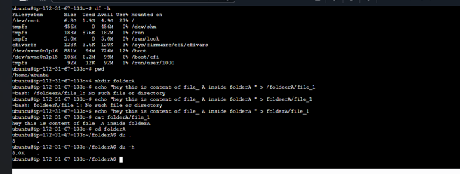
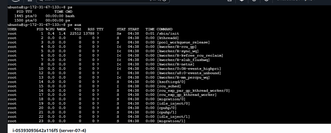
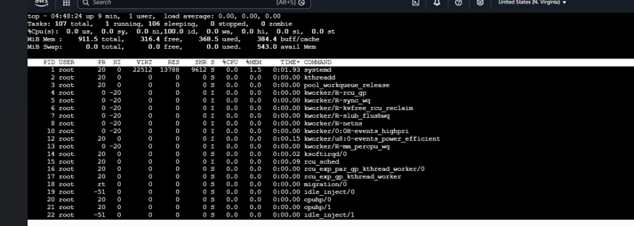
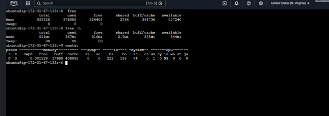

                             -- Day 03 - Disk Usage and Processes--

-(What I did):
Today I learned commands related to disk usage and system processes.

-(Commands):

1. df
   Shows disk space usage

   Flags:

   * df -h → shows disk usage in human readable format

2. du
   Shows size of files and directories

   Flags:

   * du -h → shows size in human readable format

3. ps
   Shows running processes

   Flags:

   * ps aux → shows all running processes in detail

4. top
   Shows real-time running processes

5. fuser
   Shows which process is using a file or port

6. kill
   Used to stop a process

7. free
   Shows memory usage

   Flags:

   * free -h → shows memory in human readable format

8. nohup
   Runs a command in background even after logout

9. vmstat
   Shows system performance (memory, CPU, processes)

-(Screenshots)-

Disk usage output:

Process list:

Top command:

Memory usage:

What I understood

* Disk usage commands help in checking storage
* Process commands help in monitoring and controlling system
* Memory and CPU usage can be tracked

Problems

* ps aux and vmstat output was confusing
  Need more practice

Notes
These commands are important for system monitoring and real use cases.
